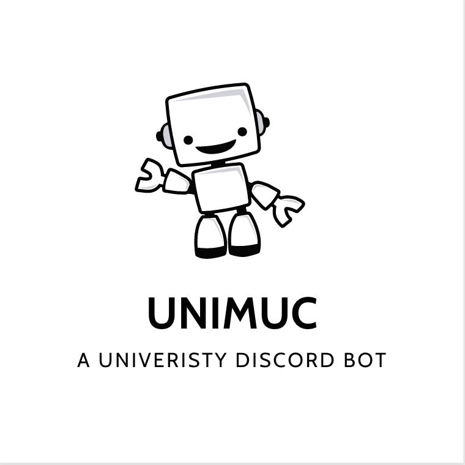
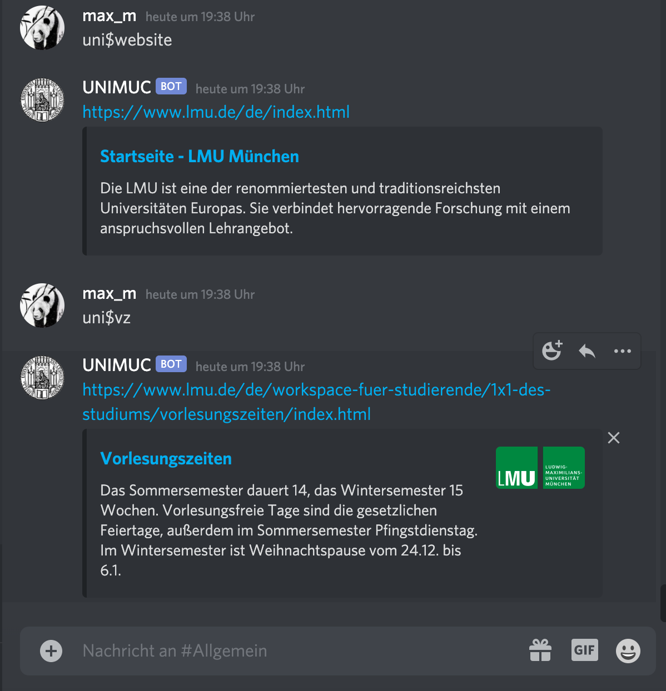
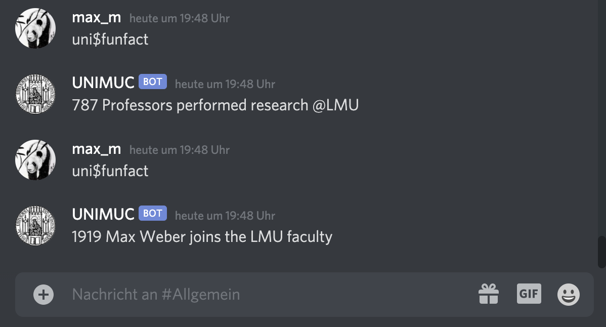
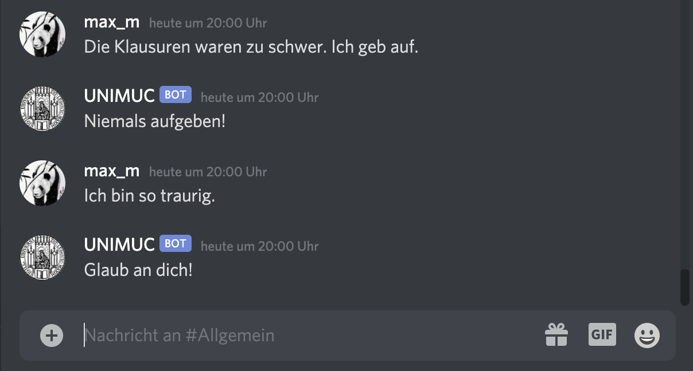

<!-- PROJECT SHIELDS -->
[![Forks][forks-shield]][forks-url]
[![Stargazers][stars-shield]][stars-url]
[![MIT License][license-shield]][license-url]
[![LinkedIn][linkedin-shield]][linkedin-url]


<!-- PROJECT LOGO -->
<br />
<div align="center">
  <a href="https://github.com/maxmlang/DiscordBot_Uni">
    
  </a>

  <h3 align="center">UNIMUC - A university discord bot</h3>

  <p align="center">
    <br />
    <a href="https://github.com/MaxMLang/discordbot_uni/issues">Report Bug</a>
    ·
    <a href="https://github.com/MaxMLang/discordbot_uni/issues">Request Feature</a>
  </p>
</div>


<!-- TABLE OF CONTENTS -->
<details>
  <summary>Table of Contents</summary>
  <ol>
    <li>
      <a href="#about-the-project">About The Project</a>
      <ul>
        <li><a href="#built-with">Built With</a></li>
      </ul>
    </li>
    <li>
      <a href="#getting-started">Getting Started</a>
      <ul>
        <li><a href="#prerequisites">Prerequisites</a></li>
      </ul>
    </li>
    <li><a href="#functions">Functions</a></li>
    <li><a href="#contributing">Contributing</a></li>
    <li><a href="#contact">Contact</a></li>
  </ol>
</details>


<!-- ABOUT THE PROJECT -->
## About The Project

Due to the Covid-19 Pandemic my friends and I were more or less forced to start our Bachelor studies online. Most of them I have not even met in real life during that time. So our main tool to communicate, study together and meet up is our own Discord server. 
On that server are almost 200 students that use it to meet up and connect. It is kind of like an virtual campus. While we were chatting and preparing for our exams, we discussed how cool it would be to have a bot that makes our virtual college life a bit easier. We discussed over a couple of functions it should have and already had some pretty cool ideas. 
Those ideas were now transformed into a working bot! 
<p align="right">(<a href="#readme-top">back to top</a>)</p>


### Built With

<a href="https://www.python.org" target="_blank" rel="noreferrer"> </a>

<p align="right">(<a href="#readme-top">back to top</a>)</p>


<!-- GETTING STARTED -->
## Getting Started
1. Clone this repo using `git clone https://github.com/MaxMLang/DiscordBot_Uni.git`
2. Create a bot with your Discord developer accoun and copy your bot token
3. Paste your bot token into the variable at the beginning of the code. NOTE: Your bot token should never be publicly avaible so set you repo to private if you will use github!
4. Specify the prefix of UNIMUC. So by using `uni$some_command` we can tell our bot what to do specifically.
```{python, eval= FALSE}
# INSERT THE SPECIFIC DISCORD TOKEN
DISCORD_TOKEN = "XXXXXXXXXXXXXXX"

# CREATES A NEW BOT OBJECT WITH A SPECIFIED PREFIX
bot = commands.Bot(command_prefix="uni$")
```


### Prerequisites
Before you can work with the bot you need to install the following packages.

**Windows users**
```
py -m pip install "discord"
py -m pip install "random"
py -m pip install "json"
py -m pip install "os" 
py -m pip install "requests" 
```

**Mac/Unix users**
```
python3 -m pip install "discord"
python3 -m pip install "random"
python3 -m pip install "json"
python3 -m pip install "os" 
python3 -m pip install "requests" 
```

<!-- USAGE EXAMPLES -->
## Functions

### Sending useful Links
Many students struggle to keep an overview over all the websites. Lecture Periods, Moodle (Platform for courses in Statistics), Uni2Work (Platform for courses in Mathematics or Computer Science) and many more. This problem belongs now to the past. UNIMUC offers multiple functions to send them the links right into the channel. These functions are simple but really powerful. 

{width=600px height=600px}

## Fun Facts
Sometimes you might be in the mood for some quick fun facts. "Did you know... 

... that UNIMUC can help you with that?"

{width=600px height=300px}

### Encouragements
Life can be frustrating. Student life can be even more frustrating, sometimes. UNIMUC will cheer you up again! 
UNIMUC can encourage you just by reading what you write in the chat. So e.g. if you write "Ich geb auf" ("I give up" in German) UNIMUC will send you some encouragement.

{width=600px height=300px}

### Quotes
Students can get an almost infinite amount of quotes from [Zenquotes](https://zenquotes.io).

{width=600px height=300px}

<p align="right">(<a href="#readme-top">back to top</a>)</p>

<!-- CONTRIBUTING -->
## Contributing

Contributions are what make the open source community such an amazing place to learn, inspire, and create. Any contributions you make are **greatly appreciated**.

If you have a suggestion that would make this better, please fork the repo and create a pull request. You can also simply open an issue with the tag "enhancement".
Don't forget to give the project a star! Thanks again!

1. Fork the Project
2. Create your Feature Branch (`git checkout -b feature/AmazingFeature`)
3. Commit your Changes (`git commit -m 'Add some AmazingFeature'`)
4. Push to the Branch (`git push origin feature/AmazingFeature`)
5. Open a Pull Request

<p align="right">(<a href="#readme-top">back to top</a>)</p>

<!-- CONTACT -->
## Contact

<a href="https://github.com/MaxMLang" target="_blank" rel="noreferrer"> </a>

<p align="right">(<a href="#readme-top">back to top</a>)</p>


<!-- MARKDOWN LINKS & IMAGES -->
<!-- https://www.markdownguide.org/basic-syntax/#reference-style-links -->
[forks-shield]: https://img.shields.io/github/forks/MaxMLang/discordbot_uni.svg?style=for-the-badge
[forks-url]: https://github.com/MaxMLang/discordbot_uni/network/members
[stars-shield]: https://img.shields.io/github/stars/MaxMLang/discordbot_uni.svg?style=for-the-badge
[stars-url]: https://github.com/MaxMLang/discordbot_uni/stargazers
[license-shield]: https://img.shields.io/github/license/othneildrew/Best-README-Template.svg?style=for-the-badge
[license-url]: https://github.com/othneildrew/Best-README-Template/blob/master/LICENSE.txt
[linkedin-shield]: https://img.shields.io/badge/-LinkedIn-black.svg?style=for-the-badge&logo=linkedin&colorB=555
[linkedin-url]: https://www.linkedin.com/in/maxmlang/

